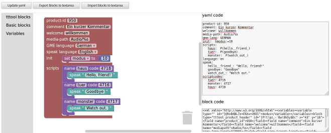

# tttool-blocks

tttool-blocks is a block-based visual programming language and editor for [tttool](https://github.com/entropia/tip-toi-reveng). 

Where the design of games in `tttool` is based on yaml files, games can be created by dragging blocks together.

tttool-blocks is based on [Google's Blockly](https://github.com/google/blockly). tttool-blocks is discussed in the [nomeata.de tiptoi mailing list](https://lists.nomeata.de/mailman/listinfo/tiptoi).

All code is free and open source.

## Status

The project is currently in a "proof of concept" phase to show how games can be designed and assembled via `tttool`. Some improvements will be required to use `tttol-blocks` for the development of games. Feel free to report issues and to contribute.

## Usage

* clone or download the git repository from [tttool-blocks github repository](https://github.com/maehw/tttool-blocks)
* open [demo/index.html](./demo/index.html) in your webbrowser (don't forget to enable JavaScript)
* drag blocks on the canvas
    * start wiht a `tttool_product_header` block; change values according to your needs
    * add any number of `tttool_script` blocks
    * add any number of `tttool_play`, `tttool_speak`, `tttool_jump` and other blocks required to map your game logic
* generate code by clicking the *Update yaml* button
* export/import blocks by clicking the other two buttons; if necessary store/load the XML code to/from a file
* use generated yaml to call `tttool`: *`tttool assemble <youryamlfile.yaml>`*

## Demo



block code:


```
<xml xmlns="http://www.w3.org/1999/xhtml"><variables><variable type="" id="}@hxB4BL7x=E6X+=vN5l">modus</variable></variables><block type="tttool_product_header" id="[P!t!pz,-`Bw!8k5y$Dc" x="43" y="18"><field name="product_id">950</field><field name="comment">Ein kurzer Kommentar</field><field name="welcome">willkommen</field><field name="mediapath">Audio/%s</field><field name="gme_lang">GERMAN</field><field name="speak_lang">en</field><statement name="init"><block type="variables_set" id="UNB~28h*~]RGiMTj~;P%"><field name="VAR" id="}@hxB4BL7x=E6X+=vN5l" variabletype="">modus</field><value name="VALUE"><block type="math_number" id="le]i9z2+e2[ip+(_+U!s"><field name="NUM">10</field></block></value></block></statement><statement name="script_container"><block type="tttool_script" id="7FkIQRML(q.O{ce==Xkf"><field name="script_name">haus</field><field name="script_code">4718</field><statement name="NAME"><block type="tttool_speak" id="6`l-oCP;ouzDV7}!rw0;"><field name="NAME">Hello, friend!</field></block></statement><next><block type="tttool_script" id="#%D}:28_YHlC55]n)Tg6"><field name="script_name">tuer</field><field name="script_code">4716</field><statement name="NAME"><block type="tttool_speak" id="iiin2.9X[P{X@3_Veo1A"><field name="NAME">Goodbye</field></block></statement><next><block type="tttool_script" id="@#^O)fcsORDh^)P[`{zh"><field name="script_name">monster</field><field name="script_code">4717</field><statement name="NAME"><block type="tttool_speak" id="{cxxRz~-iorOgdlzyO5`"><field name="NAME">Watch out.</field></block></statement></block></next></block></next></block></statement></block></xml>
```

generated yaml code:

```
product-id: 950
comment: Ein kurzer Kommentar
welcome: willkommen
media-path: Audio/%s
gme-lang: GERMAN
init:  $modus:=10
scripts:
   haus:  P(hello__friend_)
   tuer:  P(goodbye)
   monster:  P(watch_out_)
language: en
speak:
   hello__friend_: "Hello, friend!"
   goodbye: "Goodbye"
   watch_out_: "Watch out."
scriptcodes:
   tuer: 4716
   monster: 4717
   haus: 4718
```


## Links

* [Blockly project page](https://developers.google.com/blockly/)
* [Blockly github repository](https://github.com/google/blockly)
* [tttool project page](https://tttool.entropia.de/)
* [tttool github repository](https://github.com/entropia/tip-toi-reveng)
* [nomeata.de tiptoi mailing list](https://lists.nomeata.de/mailman/listinfo/tiptoi)
* [Das tttool-Buch [DE]](https://tttool.readthedocs.io/de/latest/)
* [tttool-blocks github repository](https://github.com/maehw/tttool-blocks)
